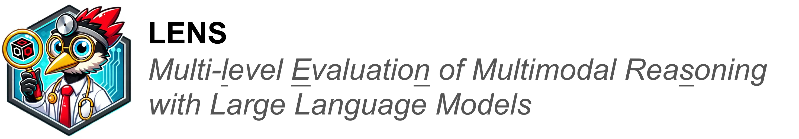
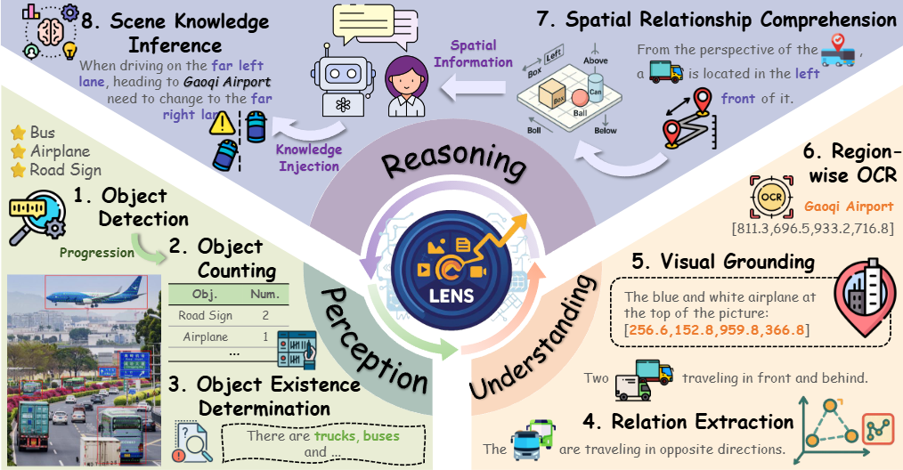
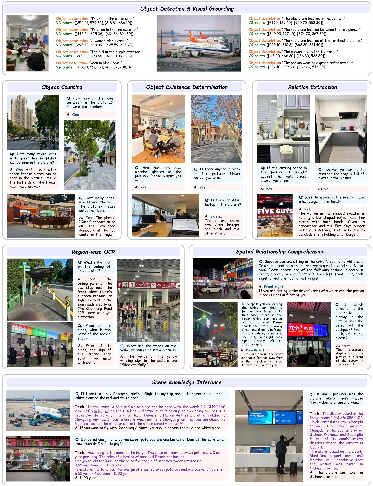
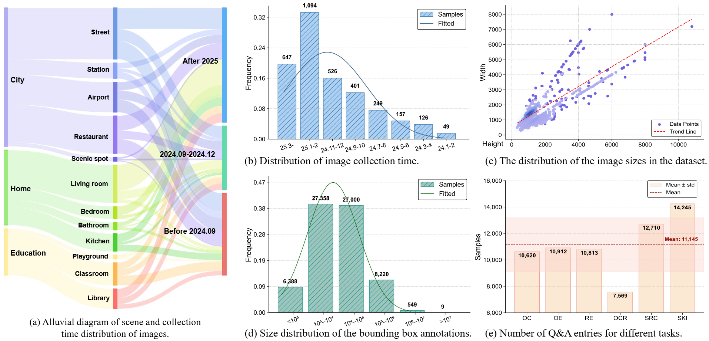

[//]: # (后续考虑将标题和logo合并为一个图片)




<div align="center">
    <p align="center">
        🔬 <b>Paper</b> (🔗 <a href="https://github.com/Mr-Bigworth/LENS/tree/main">arXiv</a>, 
        🤗 <a href="https://github.com/Mr-Bigworth/LENS/tree/main">Huggingface</a>)
    </p>
    <p align="center">
        <i>Keyworks: MLLMs, Multimodal Evaluation, Multimodal Reasoning, Open Challenges.</i>
    </p>
</div>



## 🔍 About LENS


**LENS** is a multi-level benchmark explicitly designed to assess MLLMs across three hierarchical tiers—Perception, Understanding, and Reasoning—encompassing 8 tasks and 12 real-world scenarios.

### 🌟 Key Features

- **Large-Scale, High-Quality QA Pairs**  
  ***3.4K*** contemporary photographs and ***40K*** domain-specific question-answer pairs are fully human-annotated and reviewed by domain experts.

- **Fresh and Diverse Images**  
  About 53\% of the images are from ***2025*** and more than 80\% of the images are from after ***September 2024***, capturing up-to-date visual content from ***12*** real-world scenarios.

- **Fine-Grained Category Annotations**  
  Over ***300*** fine-grained visual categories are included, allowing for a more precise evaluation of MLLM understanding.

- **Open-Ended Evaluation Protocol**  
  The benchmark supports over ***65*** distinct question styles, reflecting the diversity of real-world user intents.

[//]: # (这个在nips中提到了，有没有数据支撑，比如准确率低)
- **Challenging Cognitive Tasks**  
  Tasks are specifically designed to evaluate **functional visual intelligence**, pushing models beyond pattern recognition toward reasoning and understanding.

## 🎯 Our Vision

The emergence of models like **OpenAI o1** and **DeepSeek-R1** marks the beginning of the Large Reasoning Model (LRM) era. 
By combining the semantic power of LLMs with the systematic, multi-step reasoning abilities of LRMs, we are approaching System 2-level intelligence—and facing a new wave of opportunities and challenges for the computer vision (CV) community.

We seek to bring together researchers from **computer vision**, **multimodal learning**, and **large language models** to:

- Identify open research challenges in multimodal reasoning  
- Share insights from different domains  
- Foster collaboration across disciplines

LENS aims to serve as a rigorous, extensible foundation for future MLLM benchmarking and development.

## 📅 Schedule
- [ ] **Model Release**: The evaluation framework and associated models will be released upon completion of final validation.
- [ ] **Dataset Release**: All annotated datasets used in our benchmark will be made publicly available after paper acceptance.
- [ ] **arXiv Submission**: A preprint of the paper will be submitted to arXiv shortly.
- [ ] **Competition Launch**: A public challenge will be organized based on the proposed benchmark.

## 🧩 Subtask Samples

<div align="center"><em>A showcase of sample data from different subtasks.</em></div>

We formulated a set of open-ended, language-driven tasks to evaluate generative Multimodal Large Language Models (MLLMs):

- **Described Object Counting**: Estimating the number of object instances described by a class name or free-form expression, often under challenging conditions like occlusion, scale variation, or clutter.
- **Object Detection**: Identifying and localizing objects within an image by generating bounding boxes paired with corresponding class labels. To better match real-life scenarios and practical applications, we had annotators construct over 300 fine-grained object categories (e.g., "Coke" and "Sprite" as distinct categories) based on natural language and common sense, ensuring that one category could correspond to multiple objects in the image.
- **Object Existence Determination**: Determining whether a specific object or category exists in the image without requiring spatial localization.
- **Relation Extraction**: Identifying semantic relationships (e.g., "holding," "next to," "wearing") between object pairs to enable structured scene understanding.
- **Visual Grounding**: Localizing an image region corresponding to a natural language expression, linking linguistic references to visual content. Labelers were instructed to use unique descriptions to ensure detection targets were unambiguous in the image.
- **Region-wise OCR**: Recognizing and transcribing text within a specified image region (via coordinates or description), supporting fine-grained text understanding in complex visual scenes.
- **Spatial Relationship Comprehension**: Understanding geometric relationships (e.g., "above," "behind," "to the left front of") between objects across diverse 3D views, aiding visual-spatial reasoning.
- **Scene Knowledge Inference**: Inferring high-level semantic or functional information about the scene or making decisions based on visual context.

## 📖 Statistical Analysis 


## 💯 **Multimodal benchmark** 

| Methods         | Model size      | Perception |     |     | Understanding |    |    | Reasoning |    |
|-----------------|-----------------|------------|-----|-----|---------------|----|----|-----------|----|
| **Open source**  |                 |            |     |     |               |    |    |           |    |
| Qwen2.5-VL       | 3B             | 0.5876     | 2   | 0.7401 | 0.6652    | 5  | 0.5243 | 0.4033 | 0.6075 |
| Qwen2.5-VL       | 7B             | 0.5835     | 2   | 0.8375 | 0.7158    | 0.0448 | 0.6165 | 0.4628 | 0.7061 |
| Qwen2.5-VL       | 32B            | 0.6225     | 2   | 0.8360 | 0.7457    | 5  | 0.6564 | 0.5166 | 8  |
| Qwen2.5-VL       | 72B            | 0.5975     | 2   | 0.8567 | 0.7598    | 5  | 0.6851 | 0.5365 | 0.7095 |


We provide a comprehensive benchmark of eight latest multimodal competitors across three multimodal colonoscopy tasks, including [Qwen2.5-VL](https://github.com/QwenLM/Qwen2.5-VL/tree/main).xxx

| 比较维度/方法  | Ours | RSIEval | VQA v2 | NuScenes-QA | RSVQA | DRAMA | V*   | SPEC | CODE | CODIS | HaloQuest | VHTest | MMVP | AS-V2 | HC-RefLoCo | Visual CoT | ChatterBox | MC-Bench |
| -------------- | ---- | ------- | ------ | ----------- | ----- | ----- | ---- | ---- | ---- | ----- | --------- | ------ | ---- | ----- | ---------- | ---------- | ---------- | -------- |
| Existence      | ✓    | ✓       | ✓      | ✓           | ✓     | ✓     | ✓    | ✓    | ✓    | ✓     | ✓         | ✓      | ✓    | ✓     | ✓          | ✓          | ✓          |          |
| Attribute      | ✓    | ✓       | ✓      | ✓           |       | ✓     | ✓    | ✓    | ✓    | ✓     | ✓         | ✓      | ✓    | ✓     | ✓          | ✓          | ✓          |          |
| Counting       | ✓    | ✓       | ✓      |             | ✓     |       |      | ✓    | ✓    | ✓     |           | ✓      |      | ✓     | ✓          |            | ✓          |          |
| Localization   | ✓    | ✓       |        | ✓           | ✓     | ✓     | ✓    | ✓    | ✓    | ✓     |           | ✓      |      | ✓     | ✓          |            | ✓          | ✓        |
| Hallucination  | ✓    |         |        |             |       |       |      |      |      |       | ✓         | ✓      |      |       | ✓          |            |            |          |
| Relation/Scene | ✓    |         |        | ✓           |       |       | ✓    |      | ✓    | ✓     | ✓         | ✓      |      | ✓     | ✓          | ✓          | ✓          | ✓        |
| QA/Single-round        | ✓    | ✓       | ✓      | ✓           | ✓     | ✓     |      | ✓    | ✓    | ✓     | ✓         | ✓      | ✓    | ✓     | ✓          | ✓          | ✓          | ✓        |
| CoT/Multi-round     | ✓    |         |        |             |       |       | ✓    |      |      |       |           |        |      |       |            | ✓          | ✓          | ✓        |
| bilingual           | ✓    |         |        |             |       |       |      |      |      |       |           |        |      |       |            |            |            |          |
| multi-scene         | ✓    |         | ✓      |             |       |       | ✓    | ✓    | ✓    | ✓     | ✓         |        | ✓    | ✓     |            |            |            | ✓        |


## 🙏 Acknowledgement

We gratefully acknowledge the contributions of the following projects, which served as the foundation and inspiration for our work:

+ [Qwen](https://qwenlm.github.io/): A series of large-scale language models developed by Alibaba Group, demonstrating strong performance in instruction-following, multilingual understanding, and reasoning tasks. Qwen provides a robust foundation for research in general-purpose language modeling and serves as a strong baseline for downstream applications.
+ [InternVL](https://internvl.github.io/): An open-source vision-language model developed by OpenGVLab, designed for multimodal understanding and reasoning. InternVL offers a unified framework for integrating vision and language modalities, and has shown competitive performance across various benchmarks involving perception and cognition.

We also extend our sincere gratitude to the students whose dedicated efforts contributed significantly to the construction of the dataset.

## 👍 Citation

Please use the following reference if you find this project useful for your research or applications:

[//]: # (等待arxiv的发布)

   ```
   
   ```

## 🤝 Contact
If you have any questions, please drop us an email: lens4mllms@googlegroups.com

## 🚨 Ethical and Responsible Use

Appropriate privacy protection has been applied to all facial images in the dataset.

## 📊 Repository Traffic (Cumulative)

<!-- traffic-start -->
<table>
  <tr>
    <th align="center">👀 Views</th>
    <th align="center">🧍 Unique Views</th>
    <th align="center">📥 Clones</th>
    <th align="center">🙎 Unique Cloners</th>
  </tr>
  <tr>
    <td align="center"><strong>-</strong></td>
    <td align="center"><strong>-</strong></td>
    <td align="center"><strong>-</strong></td>
    <td align="center"><strong>-</strong></td>
  </tr>
</table>
<!-- traffic-end -->
